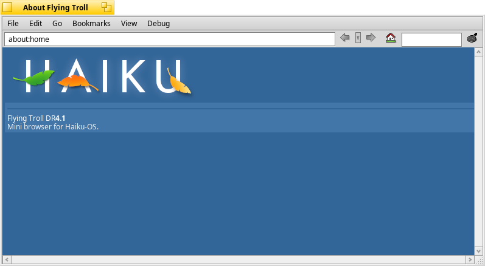

FlyingTroll
==============

> Simple application for browsing local documentation. It is like Net+ Lite, eh... And without network support :)

(Has its own HTML layout engine. No JS, CSS, networking support. But it has a lot of potential.)

License: BSD/MIT
